# Module 1 - Set up Environment
|[Main Menu](https://github.com/git-shassan/LTRSP-2119/blob/main/README.md)|[Next Module](https://github.com/git-shassan/LTRSP-2119/blob/main/Module%202%20-%20XRd%20on%20OpenShift%20onprem/README.md)|
|----------------------------|----------------------------|

## Open dCloud environment

Navigate to [dCloud sessions](https://dcloud2-rtp.cisco.com/dashboard/sessions?returnPathTitleKey=view-session).

A session should be shared with you:

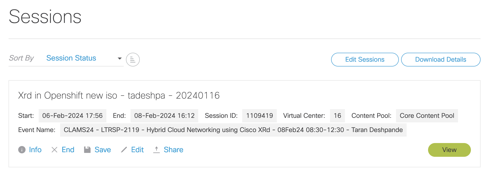

Click on view. Then select details in the blue menu bar and scroll down to view the Anyconnect Credentials.

Also take a note of your Public IP address. It is likely to be in 64.100.13.x range. **This is your Public On-Prem IP that will be used later on in Module 5**

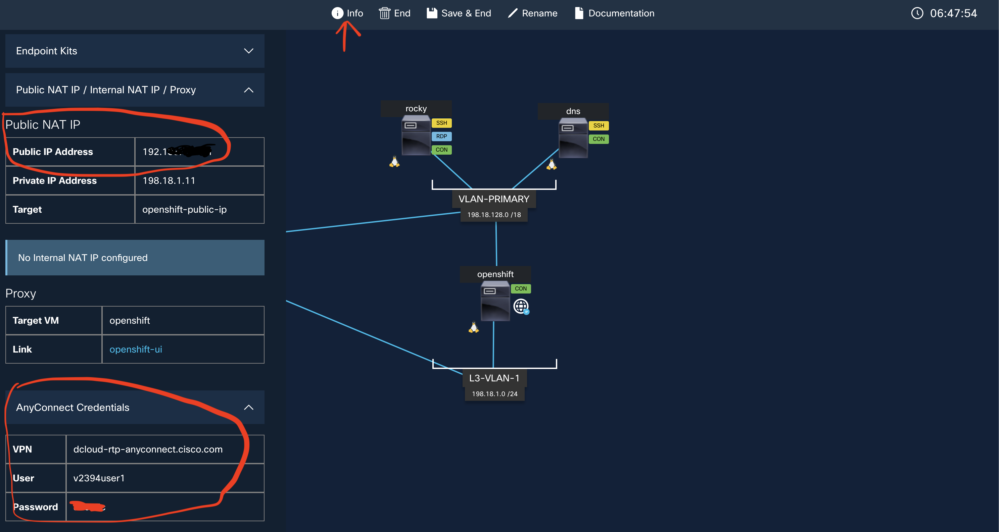


Next, on your local machine, open the Cisco Anyconnect SEcure Mobility Client.

Enter these Anyconnect Credentials and connect.

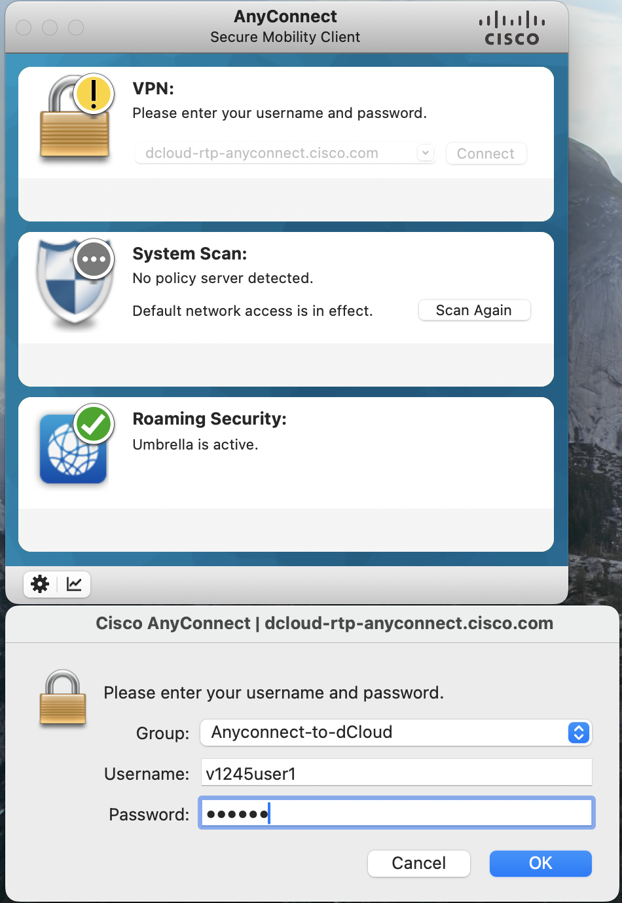


## Setting up VS Code as a development environment

We recommend using Visual Studio Code as your development environment. It is pre-installed on your laptop and includes an integrated terminal and text editor.

To connect it to the Rocky Linux devbox, click on the "Connect to..." link on the start menu:

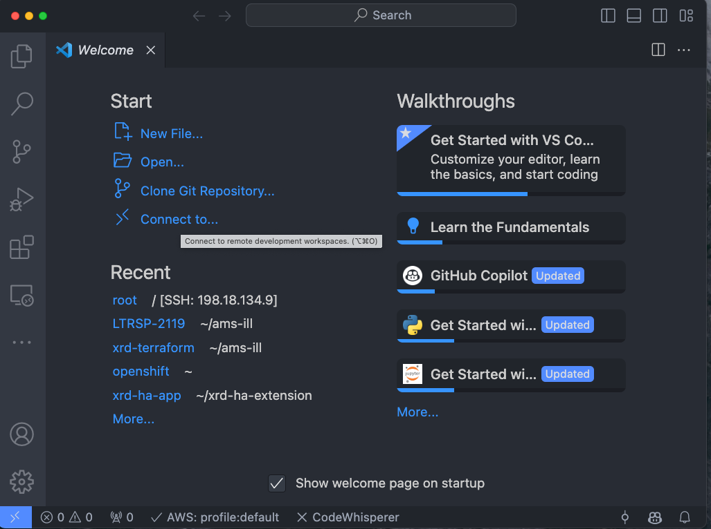

And enter `root@198.18.134.9:`

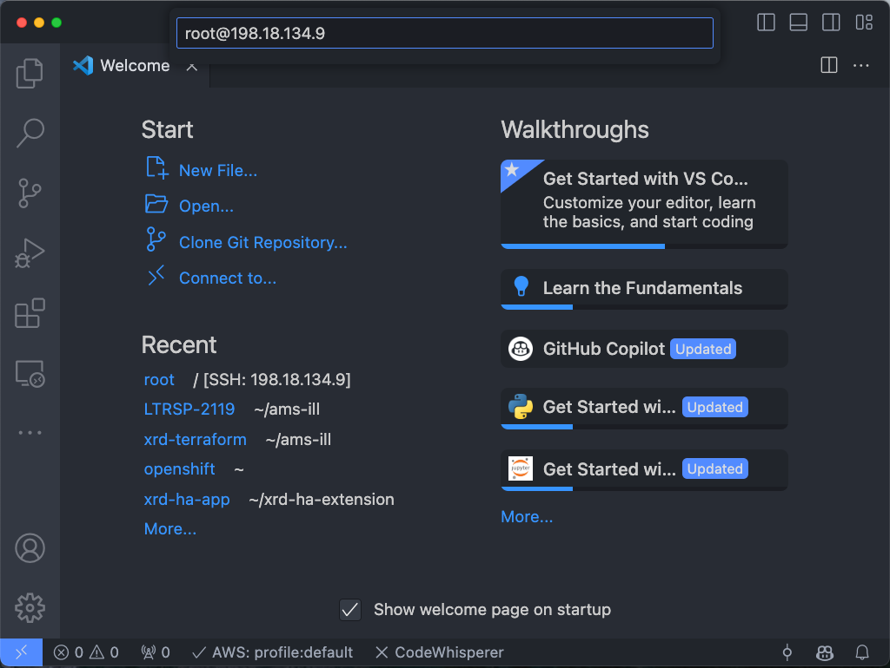
When prompted, enter the password: `C1sco12345`

Confirm that VSCode is logged in by checking the blue box on the bottom-left corner. From here open the root folder.

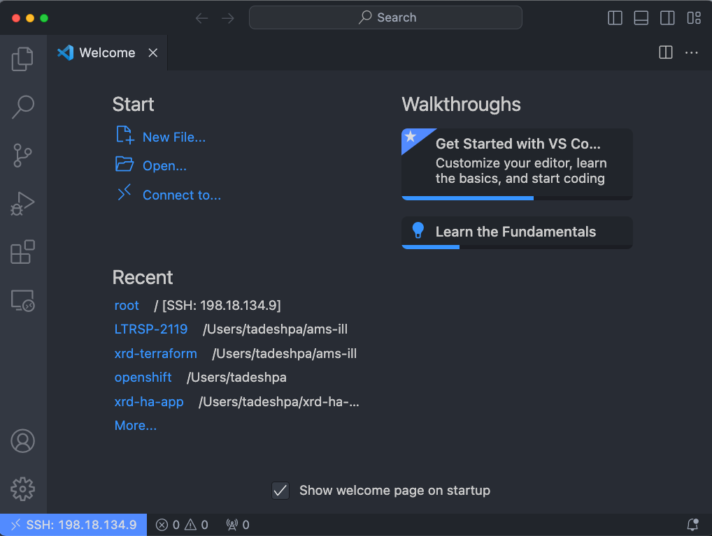

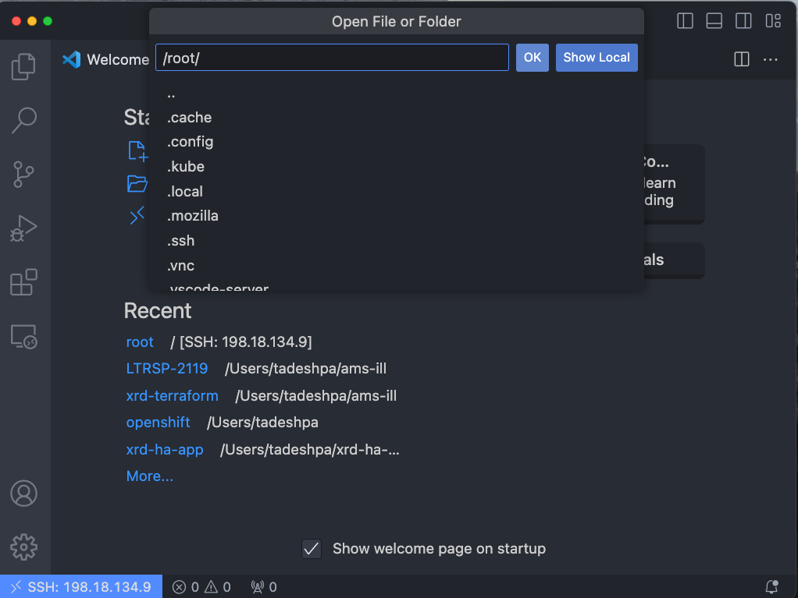
## RDP to Rocky Linux
Return to the dCloud web page, and click on the Rocky Linux Image. Then click on the Remote Desktop hyperlink.

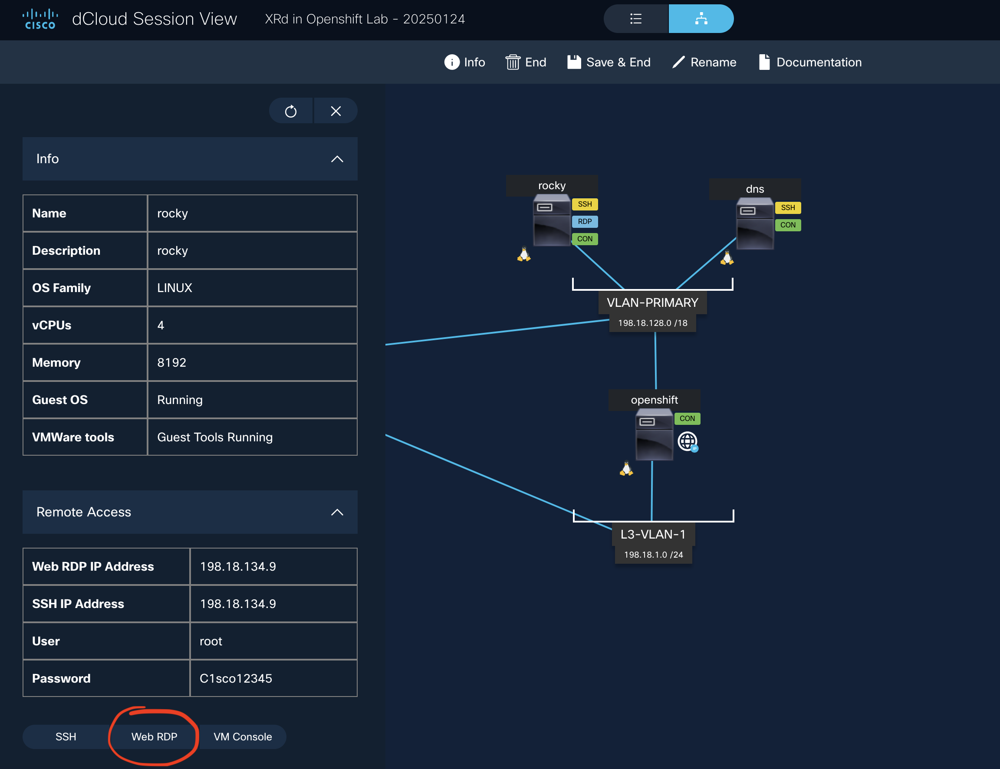

This will launch a pop-up tab:

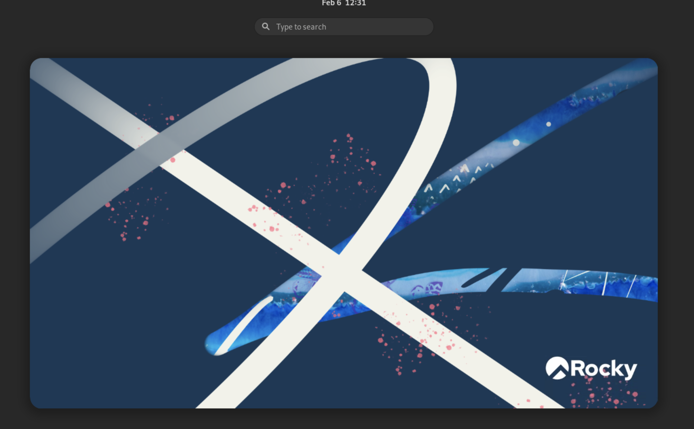

Click on the "Activities" botton on top left, which will bring up the application tab towards the bottom. You can select the Terminal or Firefox from this menu as show here: 
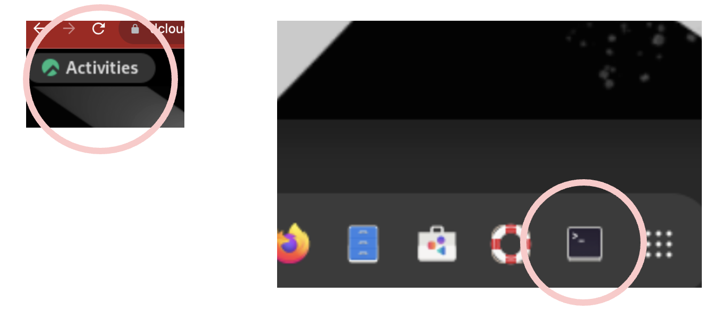

Using Firefox, you can login to OpenShift Console and get a feel of the GUI for the OpenShift Container Platform. The bookmark has been created on Firefox and login/password should be saved in teh browser already.

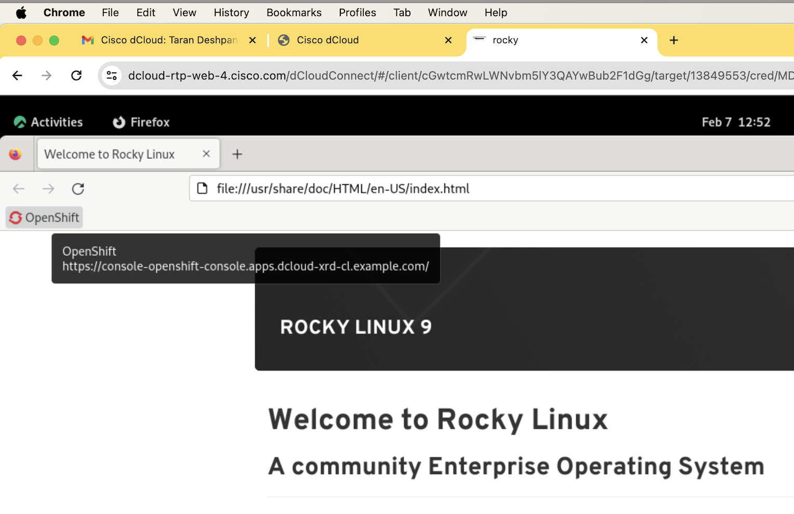

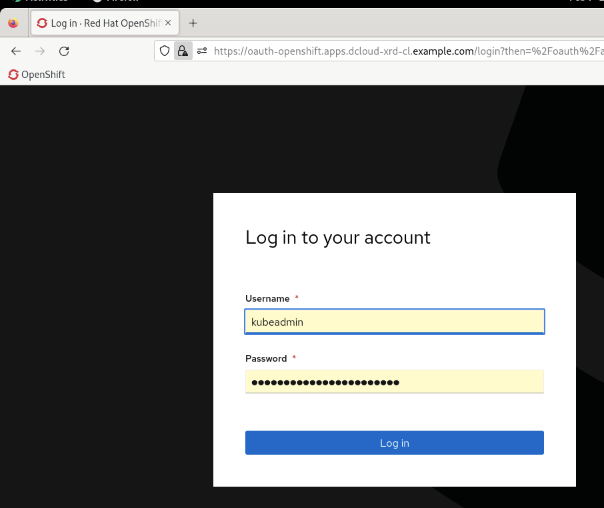

 Once logged in, you can look at the compute node. This is the node on which you will later run your On-Premises XRd instance. 
 
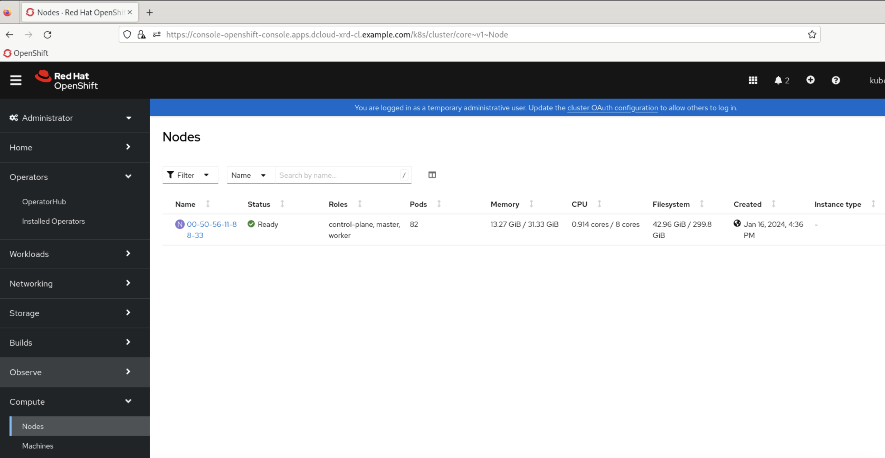

## Clone the Lab Materials to your Rocky Linux server: 
The lab material contains scripts and files that will be useful to complete the tasks. This steps shows how the material can be copied to your local machine. Navigate to the terminal within VS Code.

Use the following commands to download the lab guide on your dCloud enviroment: 
```
cd ~
git clone https://github.com/git-shassan/LTRSP-2119.git
```

Verify that Git Repo has been locally cloned on your workstation. The Repo will be in a folder called LTRSP-2119 as shown below:

```
[root@rocky ~]# ls -l
total 68
-rw-------.  1 root root  1370 Jan 12 17:31 anaconda-ks.cfg
-rw-r--r--.  1 root root  1066 Feb  7 12:37 baseline.sh
-rw-r--r--.  1 root root  3510 Feb  7 09:13 baseline.sh.1
drwxr-xr-x.  2 root root  4096 Jan 12 18:14 Desktop
drwxr-xr-x.  2 root root  4096 Jan 12 18:14 Documents
drwxr-xr-x.  2 root root  4096 Jan 12 18:14 Downloads
-rwx------.  1 root root 11679 Feb  7 12:37 get_helm.sh
drwxr-xr-x. 15 root root  4096 Feb  7 13:15 LTRSP-2119  
drwxr-xr-x.  2 root root  4096 Jan 12 18:14 Music
drwxr-xr-x.  2 root root  4096 Jan 12 18:14 Pictures
drwxr-xr-x.  2 root root  4096 Jan 12 18:14 Public
drwxr-xr-x.  2 root root  4096 Feb  7 12:39 temp
drwxr-xr-x.  2 root root  4096 Jan 12 18:14 Templates
drwx------.  1 root root     0 Feb  7 12:48 thinclient_drives
drwxr-xr-x.  2 root root  4096 Jan 12 18:14 Videos


[root@rocky ~]# cd LTRSP-2119/
[root@rocky LTRSP-2119]#
[root@rocky LTRSP-2119]#
[root@rocky LTRSP-2119]#
[root@rocky LTRSP-2119]# ls -l
total 68
drwxr-xr-x. 2 root root 4096 Feb  7 13:15  helm
drwxr-xr-x. 5 root root 4096 Feb  7 13:15  manifests
drwxr-xr-x. 2 root root 4096 Feb  7 13:15 'Module 0 - Setup Environment'
drwxr-xr-x. 2 root root 4096 Feb  7 13:15 'Module 1 - OpenShift install on Public Cloud'
drwxr-xr-x. 2 root root 4096 Feb  7 13:15 'Module 2 - XRd on OpenShift onprem'
drwxr-xr-x. 2 root root 4096 Feb  7 13:15 'Module 3 - XRd on EKS'
drwxr-xr-x. 2 root root 4096 Feb  7 13:15 'Module 4 - Creating Virtual Overlay on AWS'
drwxr-xr-x. 2 root root 4096 Feb  7 13:15 'Module 5 - Connecting Physical and Cloud Infrastructure'
drwxr-xr-x. 2 root root 4096 Feb  7 13:15 'Module 6 - [Bonus] Install and configure XRd on OpenShift in public cloud'
-rw-r--r--. 1 root root 5499 Feb  7 13:15  ocp_onprem.md
-rw-r--r--. 1 root root 1191 Feb  7 13:15  README.md
drwxr-xr-x. 4 root root 4096 Feb  7 13:15 'Router Configs'
drwxr-xr-x. 2 root root 4096 Feb  7 13:15  scripts
drwxr-xr-x. 3 root root 4096 Feb  7 13:15  secrets
-rw-r--r--. 1 root root 5196 Feb  7 13:15  to_add.md
```

**Congratulations!!! You've just cloned the repo locally and verfied that you environment is setup correctly. Now lets create your AWS Environment**


## Install and Configure the AWS CLI with the demo account
    cd ~
    curl "https://awscli.amazonaws.com/awscli-exe-linux-x86_64.zip" -o "awscliv2.zip"
    unzip awscliv2.zip
    sudo ./aws/install

## Access your AWS account
You should have received your AWS credentials from the lab proctors.

Let's configure our AWS CLI to have access to our demo account

    aws configure


And fill in the the Access Key ID and Secret access key parameters using the values we just downloaded. We will us eu-west-1 as our default region.

    AWS Access Key ID [None]: ****************NX6K
    AWS Secret Access Key [None]: ****************yUF4
    Default region name [None]: eu-west-1
    Default output format [None]: 

## Verify AWS account setup: 
The following command can be used to verify if the AWS account credentials are valid and properly configured: 
```
aws sts get-caller-identity
```
The output will look similiar to this: 
```
{
    "UserId": "AIDA47CRU2Z6CONHUF2XA",
    "Account": "891376948860",
    "Arn": "arn:aws:iam::891376948860:user/ocp"
}
```

Move to Next module

|[Main Menu](https://github.com/git-shassan/LTRSP-2119/blob/main/README.md)|[Next Module](https://github.com/git-shassan/LTRSP-2119/blob/main/Module%202%20-%20XRd%20on%20OpenShift%20onprem/README.md)|
|----------------------------|----------------------------|


