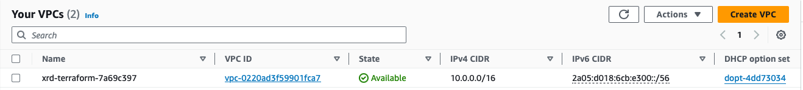
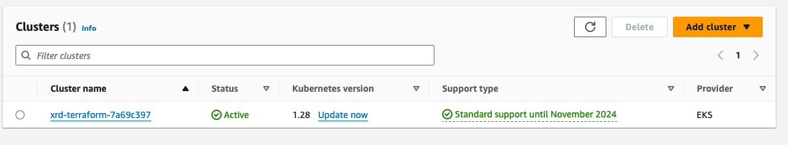
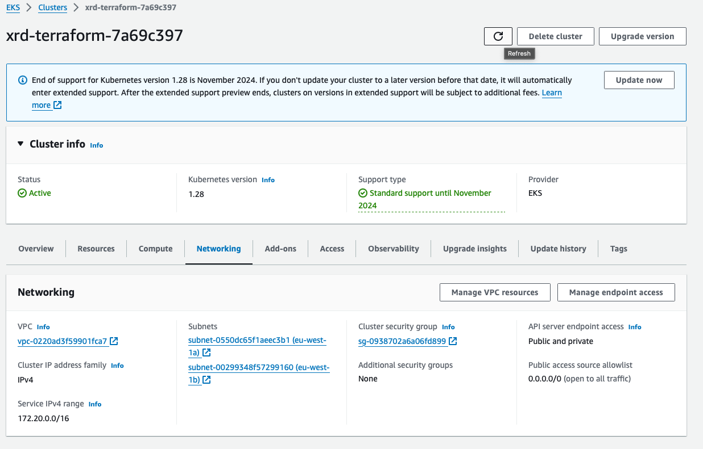
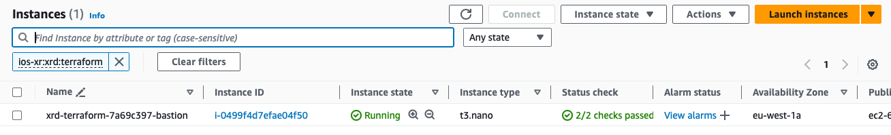
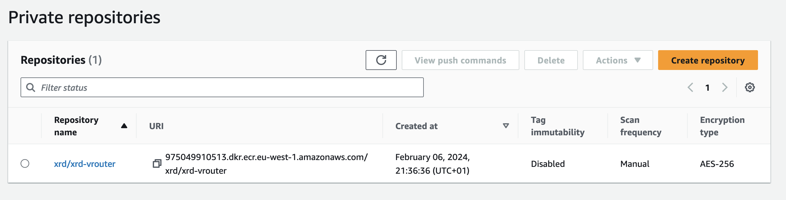
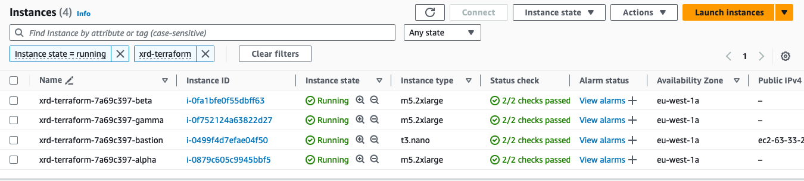
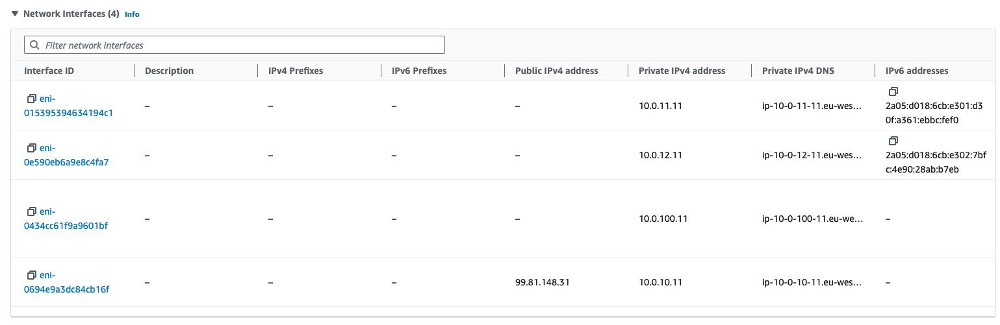

# Module 3 - Launching XRd on Amazon Elastic Kubernetes Service
|[Previous Module](https://github.com/git-shassan/LTRSP-2119/blob/main/Module%202%20-%20XRd%20on%20OpenShift%20onprem/README.md)|[Main Menu](https://github.com/git-shassan/LTRSP-2119/blob/main/README.md)|[Next Module](https://github.com/git-shassan/LTRSP-2119/blob/main/Module%204%20-%20Creating%20Virtual%20Overlay%20on%20AWS/README.md)|
|----------------------------|----------------------------|----------------------------|

With the release of IOS XR 7.8.1, XRd is supported as a Cloud Router and SR-PCE. In this tutorial we will explore how to deploy a topology of XRd cloud routers on Amazon Elastic Kubernetes Service (EKS).

<!-- ## Prerequisites
 * The [`aws cli`](https://docs.aws.amazon.com/cli/latest/userguide/getting-started-install.html) installed and configured on our local machine with account details.
 * [`terraform`](https://www.terraform.io/) 
 * [`packer`](https://www.packer.io/) - which we will to build an AMI suitable to host XRd 

### Install Terraform
Terraform is the Infrastructure as Code tool that we will use to provision our AWS resources.

    wget https://releases.hashicorp.com/terraform/1.7.1/terraform_1.7.1_linux_amd64.zip
    unzip terraform_1.7.1_linux_amd64.zip
    mv ./terraform /usr/local/bin/terraform
-->
## Clean EIP resources: 
The following script will be used to free up some elastic IPs that we don't use for the lab:
```
source ~/LTRSP-2119/scripts/clean-eip.sh &
```

## Creating AWS Resources using Terraform
The [xrd-terraform](https://github.com/tdesh10/xrd-terraform/) contains the modules that we will use to provision our AWS infrastructure.
    
    cd ~
    git clone https://github.com/tdesh10/xrd-terraform.git
    cd xrd-terraform/

### Create Bootstrap Resources
We will begin by running the bootstrap module. This configuration creates a base set of cloud infrastructure resources:

- [VPC](https://docs.aws.amazon.com/vpc/latest/userguide/what-is-amazon-vpc.html)
- [EKS cluster](https://docs.aws.amazon.com/eks/latest/userguide/clusters.html)
- Bastion node (used for access to any subsequently created worker nodes)
- Key pair (assigned to the Bastion and any subsequently created worker nodes)

To run the module:

    terraform -chdir=examples/bootstrap init
    terraform -chdir=examples/bootstrap apply

You will soon be prompted for confirmation to provision these cloud resources:
    
    Plan: 39 to add, 0 to change, 0 to destroy.

    Changes to Outputs:
    + bootstrap = {
        + bastion_instance_id            = (known after apply)
        + bastion_public_ip              = (known after apply)
        + bastion_security_group_id      = (known after apply)
        + cluster_name                   = (known after apply)
        + key_pair_filename              = (known after apply)
        + key_pair_name                  = (known after apply)
        + kubeconfig_path                = "/root/xrd-terraform/examples/bootstrap/.kubeconfig"
        + name_prefix                    = (known after apply)
        + node_iam_instance_profile_name = (known after apply)
        + node_iam_role_name             = (known after apply)
        + oidc_issuer                    = (known after apply)
        + oidc_provider                  = (known after apply)
        + placement_group_name           = (known after apply)
        + private_subnet_ids             = [
            + (known after apply),
            + (known after apply),
            ]
        + vpc_id                         = (known after apply)
        }

    Do you want to perform these actions?
    Terraform will perform the actions described above.
    Only 'yes' will be accepted to approve.

    Enter a value: yes

> [!Note]
> These resources will take ~10mins to provision - Enjoy a short break!

After confirmation, logs detailing the creation of all these cloud resources will be displayed.

    Apply complete! Resources: 39 added, 0 changed, 0 destroyed.

    Outputs:

    bootstrap = {
      "bastion_instance_id" = "i-0eb5df96a054efc2a"
      "bastion_public_ip" = "3.250.163.161"
      "bastion_security_group_id" = "sg-0ddbc0268e026164f"
      "cluster_name" = "xrd-terraform-7a69c397"
      "key_pair_filename" = "/root/xrd-terraform/examples/bootstrap/xrd-terraform-7a69c397.pem"
      "key_pair_name" = "xrd-terraform-7a69c397"
      "kubeconfig_path" = "/root/xrd-terraform/examples/bootstrap/.kubeconfig"
      "name_prefix" = "xrd-terraform-7a69c397"
      "node_iam_instance_profile_name" = "xrd-terraform-7a69c397-node"
      "node_iam_role_name" = "xrd-terraform-7a69c397-node"
      "oidc_issuer" = "https://oidc.eks.us-east-1.amazonaws.com/id/26CC37725BB6F049958E025E1E139092"
      "oidc_provider" = "arn:aws:iam::975049910513:oidc-provider/oidc.eks.us-east-1.amazonaws.com/id/26CC37725BB6F049958E025E1E139092"
      "placement_group_name" = "xrd-terraform-7a69c397"
      "private_subnet_ids" = [
        "subnet-04ca2f998ad3b10ed",
        "subnet-0b2a5788e041acda4",
      ]
      "vpc_id" = "vpc-04859e0d6c562cc29"
    }

Take note of the **cluster_name**. We will use this to create a new kubeconfig to use to interact with the EKS Cluster.

Create new kubeconfig file:
    
    touch /root/.kube/eks
    export KUBECONFIG=/root/.kube/eks

Now update the kubeconfig to point to the EKS Cluster:

    aws eks update-kubeconfig --name=[CLUSTER NAME]

> [!Note]
> Make sure you replace the name with _your_ **cluster_name**


Now that you are logged in, check the VPC and EKS clusters by clicking the links below:

[VPC](https://us-east-1.console.aws.amazon.com/vpcconsole/home?region=us-east-1#vpcs:)



[EKS Cluster](https://us-east-1.console.aws.amazon.com/eks/home?region=us-east-1#/clusters)





[Bastion](https://us-east-1.console.aws.amazon.com/ec2/home?region=us-east-1#Instances:search=:ios-xr:xrd:terraform;v=3;$case=tags:true%5C,client:false;$regex=tags:false%5C,client:false)



There may be strictly enforced vCPU limits in our demo account. Since in this lab, we will not need to use the Bastion host, we will terminate the Bastion to conserve vCPUs for the EKS cluster. This can either be done in the console or via the AWS CLI:

    aws ec2 terminate-instances --instance-ids bastipn_instance_id


## Build an AMI suitable to run XRd

In a previous module, we set up kernel parameters, hugepages, and drivers on the OpenShift host. It is essential to consistently configure these parameters to ensure optimal performance for XRd. All [nodes](https://kubernetes.io/docs/concepts/architecture/nodes/) in EKS run on [EC2](https://aws.amazon.com/ec2/) instances. We will create an [Amazon Machine Image (AMI)](https://docs.aws.amazon.com/AWSEC2/latest/UserGuide/AMIs.html) with these parameters preconfigured, so that when a node boots, it is ready to run XRd.

The [xrd-packer](https://github.com/ios-xr/xrd-packer) public repository makes it seamless to build an XRd AMI for any EKS version.

First let's install packer:

    wget https://releases.hashicorp.com/packer/1.10.0/packer_1.10.0_linux_amd64.zip
    unzip packer_1.10.0_linux_amd64.zip
    mv ./packer /usr/local/bin/packer
    rm -f packer_1.10.0_linux_amd64.zip

Now we can use packer to build an AMI, with the help of the xrd-packer repo:

    git clone https://github.com/ios-xr/xrd-packer
    cd xrd-packer
    packer init .
    packer build -var kubernetes_version=1.31 amazon-ebs.pkr.hcl

It may take a few minutes, but when successfull, it will output the id of the newly created AMI:
    
    ==> amazon-ebs.base: Stopping the source instance...
        amazon-ebs.base: Stopping instance
    ==> amazon-ebs.base: Waiting for the instance to stop...
    ==> amazon-ebs.base: Creating AMI xrd-1.31-1706406811 from instance i-054e2affa60cc89eb
        amazon-ebs.base: AMI: ami-04acbd67a45602c32
    ==> amazon-ebs.base: Waiting for AMI to become ready...
    ==> amazon-ebs.base: Skipping Enable AMI deprecation...
    ==> amazon-ebs.base: Adding tags to AMI (ami-04acbd67a45602c32)...
    ==> amazon-ebs.base: Tagging snapshot: snap-0e1019e45b2b57ba0
    ==> amazon-ebs.base: Creating AMI tags
        amazon-ebs.base: Adding tag: "Base_AMI_ID": "ami-0e12ff1a3c8cf683d"
        amazon-ebs.base: Adding tag: "Base_AMI_Name": "amazon-eks-node-1.31-v20240117"
        amazon-ebs.base: Adding tag: "Generated_By": "xrd-packer"
        amazon-ebs.base: Adding tag: "Kubernetes_Version": "1.31"
    ==> amazon-ebs.base: Creating snapshot tags
    ==> amazon-ebs.base: Terminating the source AWS instance...
    ==> amazon-ebs.base: Cleaning up any extra volumes...
    ==> amazon-ebs.base: No volumes to clean up, skipping
    ==> amazon-ebs.base: Deleting temporary security group...
    ==> amazon-ebs.base: Deleting temporary keypair...
    Build 'amazon-ebs.base' finished after 3 minutes 5 seconds.

    ==> Wait completed after 3 minutes 5 seconds

    ==> Builds finished. The artifacts of successful builds are:
    --> amazon-ebs.base: AMIs were created:
    us-east-1: ami-04acbd67a45602c32

And if we navigate to the AMIs page in the [AWS console](https://us-east-1.console.aws.amazon.com/ec2/home?region=us-east-1#Images:visibility=owned-by-me), we can see that this new AMI is present.


## Upload XRd image to Elastic Container Registry (ECR)
EKS needs to pull the XRd image from a container image repository which is accessible to AWS. For this, we will create a repository using AWS’s ECR (Elastic Container Registry) service and host the XRd images there. To do this, we will use the `publish-ecr` script located in the `xrd-terraform` git repository.

First, we need to install a tool called skopeo to run the script:

    dnf install -y skopeo

Now we can run the `publish-ecr` script

    cd ~/xrd-terraform/
    ./publish-ecr ../xrd-vrouter-container-x64.dockerv1.tgz

On the AWS Console, we can see that the xrd-vrouter image is available as well.

[ECR](https://us-east-1.console.aws.amazon.com/ecr/private-registry/repositories?region=us-east-1)



## Create the Topology's EC2 and Networking Infrastructure
The cleu-topology/infra module handles the provisioning of the core infrastructure for our topology. It deploys three EC2 instances using our recently created AMI and associates them with our existing EKS Cluster. Additionally, the module establishes network interfaces and subnets within our VPC. Each node is equipped with multiple Elastic Network Interfaces ([ENIs](https://docs.aws.amazon.com/AWSEC2/latest/UserGuide/using-eni.html)), each linked to a specific subnet. These ENIs are distributed across different subnets within each node.

    cd ~/xrd-terraform/
    terraform -chdir=examples/cleu-topology/infra init
    terraform -chdir=examples/cleu-topology/infra apply

Once again, we will be promped for confirmation to provision these resources:

    Plan: 37 to add, 0 to change, 0 to destroy.

    Changes to Outputs:
    + cluster_name    = "xrd-terraform-7a69c397"
    + kubeconfig_path = "/root/xrd-terraform/examples/bootstrap/.kubeconfig"
    + nodes           = {
        + alpha = (known after apply)
        + beta  = (known after apply)
        + gamma = (known after apply)
        }

    Do you want to perform these actions?
    Terraform will perform the actions described above.
    Only 'yes' will be accepted to approve.

    Enter a value: yes
    
This module completes fairly quickly, in 2-3 mins.

    Apply complete! Resources: 37 added, 0 changed, 0 destroyed.

    Outputs:

    cluster_name = "xrd-terraform-7a69c397"
    kubeconfig_path = "/root/xrd-terraform/examples/bootstrap/.kubeconfig"
    nodes = {
    "alpha" = "i-0879c605c9945bbf5"
    "beta" = "i-0fa1bfe0f55dbff63"
    "gamma" = "i-0f752124a63822d27"
    }

Navigate to the [EC2 Dashboard](https://us-east-1.console.aws.amazon.com/ec2/home?region=us-east-1#Instances:instanceState=running;search=:xrd-terraform;v=3;$case=tags:true%5C,client:false;$regex=tags:false%5C,client:false;sort=instanceTypeFilter) to see the newly created instances:



Notice that alpha and beta have public IP addresses assigned to one interface respectively. We will use these interfaces to connect to the XRd running in Openshift in Dcloud.



## Launch XRd Workloads
The cleu-topology/workload module will pull the XRd image from ECR, and create and deploy XRd pods on assigned worker nodes.

    terraform -chdir=examples/cleu-topology/workload init
    terraform -chdir=examples/cleu-topology/workload apply

Terraform will also prompt for the initial XR username and password.

    var.xr_root_password
    Root user password to use on XRd instances

    Enter a value: cisco123

    var.xr_root_user
    Root user name to use on XRd instances

    Enter a value: cisco

    ...

    Plan: 3 to add, 0 to change, 0 to destroy.

    Changes to Outputs:
    + cluster_name = "xrd-terraform-7a69c397"

    Do you want to perform these actions?
    Terraform will perform the actions described above.
    Only 'yes' will be accepted to approve.

    Enter a value: yes

After just a minute, our XRd workloads have launched:

    Apply complete! Resources: 3 added, 0 changed, 0 destroyed.

    Outputs:

    cluster_name = "xrd-terraform-7a69c397"

We can view our running [pods](https://kubernetes.io/docs/concepts/workloads/pods/) by using the `kubectl` command:

    [root@rocky ~]# kubectl get pods
    NAME                 READY   STATUS    RESTARTS   AGE
    xrd1-xrd-vrouter-0   1/1     Running   0          90s
    xrd2-xrd-vrouter-0   1/1     Running   0          90s
    xrd3-xrd-vrouter-0   1/1     Running   0          90s

## Connect to XRd Workloads
We can also use the `kubectl` to connect to each XRd. Login with the parameters that you previously set.

    [root@rocky ~]# kubectl exec -it xrd1-xrd-vrouter-0 -- xr

    User Access Verification

    Username: cisco
    Password: 


    RP/0/RP0/CPU0:xrd1#

For your reference:

**Please open each XRd instance in a new terminal. It will make things easier for modules 4 and 5**

XRd1:

    export KUBECONFIG=/root/.kube/eks
    kubectl exec -it xrd1-xrd-vrouter-0 -- xr

XRd2: 

    export KUBECONFIG=/root/.kube/eks
    kubectl exec -it xrd2-xrd-vrouter-0 -- xr

XRd3:

    export KUBECONFIG=/root/.kube/eks
    kubectl exec -it xrd3-xrd-vrouter-0 -- xr

## Verify Underlay Connectivity

Now you will verify Interfaces, IP addresses and underlay connectivity. Underlay is the AWS transport in this case. 

First, use _**show ip interface brief**_ on XRd routers and compare the interfaces and IP's as shown in the topology above:

**On XRD1:** 
```
RP/0/RP0/CPU0:xrd1#sh ip interface brief 
Interface                      IP-Address      Status          Protocol Vrf-Name
Loopback0                      1.0.0.11        Up              Up       default 
HundredGigE0/0/0/0             10.0.10.11      Up              Up       default 
HundredGigE0/0/0/1             10.0.11.11      Up              Up       default 
HundredGigE0/0/0/2             10.0.12.11      Up              Up       default 
```
**On XRd2:**
```
RP/0/RP0/CPU0:xrd2#sh ip int br
Interface                      IP-Address      Status          Protocol Vrf-Name
Loopback0                      1.0.0.12        Up              Up       default 
HundredGigE0/0/0/0             10.0.10.12      Up              Up       default 
HundredGigE0/0/0/1             10.0.11.12      Up              Up       default 
HundredGigE0/0/0/2             10.0.12.12      Up              Up       default 
RP/0/RP0/CPU0:xrd2#
```
**On XRd3:**
```
RP/0/RP0/CPU0:xrd3#sh ip int br
Interface                      IP-Address      Status          Protocol Vrf-Name
Loopback0                      1.0.0.13        Up              Up       default 
HundredGigE0/0/0/0             10.0.11.13      Up              Up       default 
HundredGigE0/0/0/1             10.0.12.13      Up              Up       default 
```

**Note** If loopback interface (Lo0) is missing on any router, please create it using the IP addresses shown. Loopbacks have a /32 mask.

<br>
Next, use **pings** between XRD1, 2, and 3 to ensure connectivity on the 10.0.11.0/24 subnet. 


**On XRd1**

Ping 10.0.11.12 (XRd2) and 10.0.11.13 (XRd3) from XRd1 as shown below: 
```
RP/0/RP0/CPU0:xrd1#ping 10.0.11.12
Mon Jan 29 00:14:37.661 UTC
Type escape sequence to abort.
Sending 5, 100-byte ICMP Echos to 10.0.11.12 timeout is 2 seconds:
!!!!!
Success rate is 100 percent (5/5), round-trip min/avg/max = 2/2/3 ms


RP/0/RP0/CPU0:xrd1#ping 10.0.11.13
Mon Jan 29 00:14:42.707 UTC
Type escape sequence to abort.
Sending 5, 100-byte ICMP Echos to 10.0.11.13 timeout is 2 seconds:
!!!!!
Success rate is 100 percent (5/5), round-trip min/avg/max = 2/2/3 ms
```

**On XRD2**

Ping 10.0.11.11 (XRd1) and 10.0.11.13 (XRd3) from XRd2 as shown below: 
```
RP/0/RP0/CPU0:xrd2#ping 10.0.11.11
Mon Jan 29 00:18:06.697 UTC
Type escape sequence to abort.
Sending 5, 100-byte ICMP Echos to 10.0.11.11 timeout is 2 seconds:
!!!!!
Success rate is 100 percent (5/5), round-trip min/avg/max = 2/2/3 ms


RP/0/RP0/CPU0:xrd2#ping 10.0.11.13
Mon Jan 29 00:18:11.015 UTC
Type escape sequence to abort.
Sending 5, 100-byte ICMP Echos to 10.0.11.13 timeout is 2 seconds:
!!!!!
Success rate is 100 percent (5/5), round-trip min/avg/max = 5/7/14 ms
RP/0/RP0/CPU0:xrd2#
```

**On XRd3**

Ping 10.0.11.11 (XRd1) and 10.0.11.12 (XRd2) from XRd2 as shown below: 
```
RP/0/RP0/CPU0:xrd3#ping 10.0.11.11
Mon Jan 29 00:19:28.898 UTC
Type escape sequence to abort.
Sending 5, 100-byte ICMP Echos to 10.0.11.11 timeout is 2 seconds:
!!!!!
Success rate is 100 percent (5/5), round-trip min/avg/max = 2/2/3 ms


RP/0/RP0/CPU0:xrd3#ping 10.0.11.12
Mon Jan 29 00:19:31.610 UTC
Type escape sequence to abort.
Sending 5, 100-byte ICMP Echos to 10.0.11.12 timeout is 2 seconds:
!!!!!
Success rate is 100 percent (5/5), round-trip min/avg/max = 2/2/3 ms
RP/0/RP0/CPU0:xrd3#
```

---

|[Previous Module](https://github.com/git-shassan/LTRSP-2119/blob/main/Module%202%20-%20XRd%20on%20OpenShift%20onprem/README.md)|[Main Menu](https://github.com/git-shassan/LTRSP-2119/blob/main/README.md)|[Next Module](https://github.com/git-shassan/LTRSP-2119/blob/main/Module%204%20-%20Creating%20Virtual%20Overlay%20on%20AWS/README.md)|
|----------------------------|----------------------------|----------------------------|

