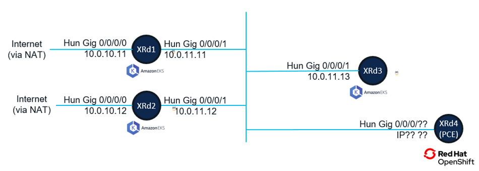
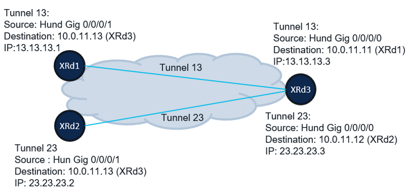
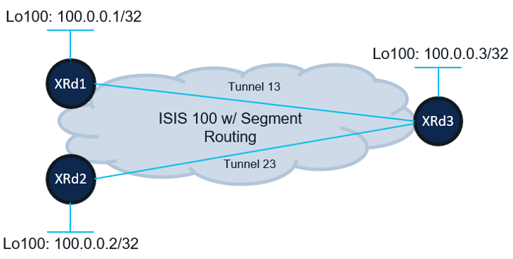

# Module 4 - Creating Your Virtual Network Infrastructure
|[Previous Module](https://github.com/git-shassan/LTRSP-2119/blob/main/Module%203%20-%20XRd%20on%20EKS/README.md)|[Main Menu](https://github.com/git-shassan/LTRSP-2119/blob/main/README.md)|[Next Module](https://github.com/git-shassan/LTRSP-2119/blob/main/Module%205%20-%20Connecting%20Physical%20and%20Cloud%20Infrastructure/README.md)|
|----------------------------|----------------------------|----------------------------|


Now that the routers are onboarded on AWS using EKS and Red Hat OpenShift, lets look at how to create your virtual network infrastructure using XRd on public cloud. Creating this network infrastructure is critical (because .....)

Lets take a look at the EKS based infrastructure comprising XRd1, XRd2, and XRd3 first. These routers are connected with each other as shown in the image below: 



In this lab module, you will: 

1. Build and Verify an Overlay GRE network
2. Run IGP over the GRE overlay 
3. Enabled Segment Routing on virtual infrastructure

## 1. Establish Virtual Overlay Using GRE Tunnels

Amazon EKS provides base IP connectivity, but do not allow MPLS or Segmenting Routing to run natively on the infrastructure. For this reason, an overlay network comprising of GRE interfaces is necessary to establish routing and provide value added services like VPN using MPLS or Segmenting. 

In this module, you will establish GRE Tunnels between XRd1, XRD2, and XRd3 as shown below. 



Lets get working!!!


### Establish GRE Tunnel Between XRd1 and XRd3
In this exercise, you will establish a GRE tunnel between XRd1 and XRd3 as shown in the figure above

**Configure Tunnel Interface on XRd1**

Configure and verify GRE Tunnel (interface tunnel-ip 13) on XRd1 using the configuration below.

You can copy paste this configuration as is. 
```
configure terminal
interface tunnel-ip13
  mtu 1450
  ipv4 address 13.13.13.1 255.255.255.0
  tunnel mode gre ipv4
  tunnel source HundredGigE0/0/0/1
  tunnel destination 10.0.11.13
  commit
 end

```

Verify the tunnel is up:
```
RP/0/RP0/CPU0:xrd1#sh ip inter brief tunnel-ip13
Interface                      IP-Address      Status                Protocol
tunnel-ip13                    13.13.13.1      Up                    Up      
```

**Configure Tunnel Interface on XRd3**

Configure a GRE Tunnel (interface tunnel-ip 13) on XRd3 using the configuration below.

You can copy paste this configuration as is. 
```
configure terminal
interface tunnel-ip13
 mtu 1450
 ipv4 address 13.13.13.3 255.255.255.0
 tunnel mode gre ipv4
 tunnel source HundredGigE0/0/0/0
 tunnel destination 10.0.11.11
commit
end

```

Verify the tunnel is up:
```
RP/0/RP0/CPU0:xrd3#sh ip int br tunnel-ip13
Interface                      IP-Address      Status                Protocol
tunnel-ip13                    13.13.13.3      Up                    Up      
```

**Verify Tunnel Functionality**

Ping between the tunnel interfaces from both XRd1 and XRd3 as shown below: 

```
RP/0/RP0/CPU0:xrd1#ping 13.13.13.3
Type escape sequence to abort.
Sending 5, 100-byte ICMP Echos to 13.13.13.3 timeout is 2 seconds:
!!!!!
Success rate is 100 percent (5/5), round-trip min/avg/max = 2/3/4 ms
```

```
RP/0/RP0/CPU0:xrd3#ping 13.13.13.1
Type escape sequence to abort.
Sending 5, 100-byte ICMP Echos to 13.13.13.1 timeout is 2 seconds:
!!!!!
Type escape sequence to abort.
Success rate is 100 percent (5/5), round-trip min/avg/max = 1/1/1 ms
```

If the ping is not successful, check with proctors for troubleshooting. 


### Establish GRE Tunnel Between XRd2 and XRd3
In this exercise, you will establish a GRE tunnel between XRd2 and XRd3 as shown in the figure above

**Configure Tunnel Interface on XRd2**

Configure a GRE Tunnel (interface tunnel-ip 23) on XRd2 using the configuration below.

You can copy paste this configuration as is. 
```
configure terminal
interface tunnel-ip23
 mtu 1450
 ipv4 address 23.23.23.2 255.255.255.0
 tunnel mode gre ipv4
 tunnel source HundredGigE0/0/0/1
 tunnel destination 10.0.11.13
commit
end

```

Verify the tunnel is up: 
```
RP/0/RP0/CPU0:xrd2#sh ip interface brief tunnel-ip 23
Interface                      IP-Address      Status                Protocol
tunnel-ip23                    23.23.23.2      Up                    Up      
```


**Configure Tunnel Interface on XRd3**

Configure a GRE Tunnel (interface tunnel-ip 23) on XRd3 using the configuration below.

You can copy paste this configuration as is. 
```
configure terminal
interface tunnel-ip23
 mtu 1450
 ipv4 address 23.23.23.3 255.255.255.0
 tunnel mode gre ipv4
 tunnel source HundredGigE0/0/0/0
 tunnel destination 10.0.11.12
commit
end

```

Verify the tunnel is up: 
```
RP/0/RP0/CPU0:xrd3#sh ip int brief  tunnel-ip 23
Interface                      IP-Address      Status                Protocol
tunnel-ip23                    23.23.23.3      Up                    Up      
```


**Verify Tunnel Functionality**

Ping between the tunnel interfaces from both XRd2 and XRd3 as shown below: 
```
RP/0/RP0/CPU0:xrd2#ping 23.23.23.3
Type escape sequence to abort.
Sending 5, 100-byte ICMP Echos to 23.23.23.3 timeout is 2 seconds:
!!!!!
Success rate is 100 percent (5/5), round-trip min/avg/max = 2/2/3 ms

```

```
RP/0/RP0/CPU0:xrd3#ping 23.23.23.2
Type escape sequence to abort.
Sending 5, 100-byte ICMP Echos to 23.23.23.2 timeout is 2 seconds:
!!!!!
Success rate is 100 percent (5/5), round-trip min/avg/max = 2/2/3 ms

```


---
**If the pings are not successful, check with proctors for troubleshooting before moving to the next section.**

---

<br><br>

## 2. Establish IGP using the GRE Overlay
Now that an overlay network has been configured, you will configure IGP routing and segment routing on your virtual infrastructure. 

Interface Loopback 100 will be configured and advertised in ISIS as part of this exercise as shown below. 


Routers XRd1, XRd2, and XRd3 are configured with the following configurations that enables a loopback interface (Lo100) and advertises it to ISIS neighbor. remember, you can simply copy/paste these configuration directly on the respective routers. 

**XRd1 IGP Configuration**

```
configure terminal

interface Loopback100
 ipv4 address 100.0.0.1 255.255.255.255

router isis 100
 is-type level-2-only
 net 49.0000.0000.0001.00
 hello-padding disable
 address-family ipv4 unicast
  metric-style wide
  advertise link attributes

 interface Loopback100
  address-family ipv4 unicast

 interface tunnel-ip13
  point-to-point
  address-family ipv4 unicast
commit
end

```

**XRd2 IGP Configuration**
```
config terminal
interface Loopback100
 ipv4 address 100.0.0.2 255.255.255.255
!

router isis 100
 is-type level-2-only
 net 49.0000.0000.0002.00
 hello-padding disable
 address-family ipv4 unicast
  metric-style wide
  advertise link attributes
 !
 interface Loopback100
  address-family ipv4 unicast
  !
 !
 interface tunnel-ip23
  point-to-point
  address-family ipv4 unicast
  !
commit
end

```

**XRd3 IGP Configuration**
```
config t

interface Loopback100
 ipv4 address 100.0.0.3 255.255.255.255

router isis 100
 is-type level-2-only
 net 49.0000.0000.0003.00
 hello-padding disable
 address-family ipv4 unicast
  metric-style wide
  advertise link attributes
 !
 interface Loopback100
  address-family ipv4 unicast
  !
 !
 interface tunnel-ip13
  point-to-point
  address-family ipv4 unicast
  !
 !
 interface tunnel-ip23
  point-to-point
  address-family ipv4 unicast
  !
 commit
 end

```


At this point, ISIS adjecency should be establised between XRd1 and XRd3, and between XRd2 and XRd3. Loopback 100 IPs (100.0.0.x) should be propagated and reachable across all 3 routers. Verify ISIS, routing table entries and reachability to Lo100 across all routers as follows

Lets try XRd1 first.
```
RP/0/RP0/CPU0:xrd1#
RP/0/RP0/CPU0:xrd1#sh isis neigh
IS-IS 100 neighbors:
System Id      Interface        SNPA           State Holdtime Type IETF-NSF
xrd3           ti13             *PtoP*         Up    28       L2   Capable 

Total neighbor count: 1


RP/0/RP0/CPU0:xrd1#sh ip route 
<snip>
i L2 23.23.23.0/24 [115/20] via 13.13.13.3, 00:07:53, tunnel-ip13
i L2 100.0.0.2/32 [115/30] via 13.13.13.3, 00:04:20, tunnel-ip13
i L2 100.0.0.3/32 [115/20] via 13.13.13.3, 00:07:53, tunnel-ip13


RP/0/RP0/CPU0:xrd1#ping 100.0.0.2 source lo100
Type escape sequence to abort.
Sending 5, 100-byte ICMP Echos to 100.0.0.2 timeout is 2 seconds:
!!!!!
Success rate is 100 percent (5/5), round-trip min/avg/max = 2/2/3 ms

RP/0/RP0/CPU0:xrd1#ping 100.0.0.3 source lo100
Type escape sequence to abort.
Sending 5, 100-byte ICMP Echos to 100.0.0.3 timeout is 2 seconds:
!!!!!
Success rate is 100 percent (5/5), round-trip min/avg/max = 2/2/4 ms
```

Lets try XRd2 next. 

```
RP/0/RP0/CPU0:xrd2#sh isis neigh
IS-IS 100 neighbors:
System Id      Interface        SNPA           State Holdtime Type IETF-NSF
xrd3           ti23             *PtoP*         Up    25       L2   Capable 

Total neighbor count: 1


RP/0/RP0/CPU0:xrd2#sh ip route
<snip>
i L2 13.13.13.0/24 [115/20] via 23.23.23.3, 00:12:19, tunnel-ip23
i L2 100.0.0.1/32 [115/30] via 23.23.23.3, 00:12:19, tunnel-ip23
L    100.0.0.2/32 is directly connected, 00:12:29, Loopback100
i L2 100.0.0.3/32 [115/20] via 23.23.23.3, 00:12:19, tunnel-ip23

RP/0/RP0/CPU0:xrd2#
RP/0/RP0/CPU0:xrd2#ping 100.0.0.1 source lo100
Mon Jan 29 05:54:12.737 UTC
Type escape sequence to abort.
Sending 5, 100-byte ICMP Echos to 100.0.0.1 timeout is 2 seconds:
!!!!!
Success rate is 100 percent (5/5), round-trip min/avg/max = 2/2/3 ms

RP/0/RP0/CPU0:xrd2#ping 100.0.0.3 source lo100
Mon Jan 29 05:54:21.178 UTC
Type escape sequence to abort.
Sending 5, 100-byte ICMP Echos to 100.0.0.3 timeout is 2 seconds:
!!!!!
Success rate is 100 percent (5/5), round-trip min/avg/max = 2/2/3 ms

```

Finally, lets look at XRd3, which will have both XRd1 and XRd2 as its neighbors.
```
RP/0/RP0/CPU0:xrd3#sh isis neighbors 
IS-IS 100 neighbors:
System Id      Interface        SNPA           State Holdtime Type IETF-NSF
xrd1           ti13             *PtoP*         Up    22       L2   Capable 
xrd2           ti23             *PtoP*         Up    26       L2   Capable 

Total neighbor count: 2


RP/0/RP0/CPU0:xrd3#sh ip route
<snip>

i L2 100.0.0.1/32 [115/20] via 13.13.13.1, 00:23:53, tunnel-ip13
i L2 100.0.0.2/32 [115/20] via 23.23.23.2, 00:09:22, tunnel-ip23
L    100.0.0.3/32 is directly connected, 00:12:54, Loopback100


RP/0/RP0/CPU0:xrd3#ping 100.0.0.1 source lo100
Type escape sequence to abort.
Sending 5, 100-byte ICMP Echos to 100.0.0.1 timeout is 2 seconds:
!!!!!
Success rate is 100 percent (5/5), round-trip min/avg/max = 3/3/4 ms

RP/0/RP0/CPU0:xrd3#ping 100.0.0.2 source lo100
Type escape sequence to abort.
Sending 5, 100-byte ICMP Echos to 100.0.0.2 timeout is 2 seconds:
!!!!!
Success rate is 100 percent (5/5), round-trip min/avg/max = 2/2/3 ms
```

**Make sure Routing is enabled, appropriate neighbor adjecencies are established, routes are propagated and loopbacks are reachable before proceding to the next section**

---


|[Previous Module](https://github.com/git-shassan/LTRSP-2119/blob/main/Module%203%20-%20XRd%20on%20EKS/README.md)|[Main Menu](https://github.com/git-shassan/LTRSP-2119/blob/main/README.md)|[Next Module](https://github.com/git-shassan/LTRSP-2119/blob/main/Module%205%20-%20Connecting%20Physical%20and%20Cloud%20Infrastructure/README.md)|
|----------------------------|----------------------------|----------------------------|
