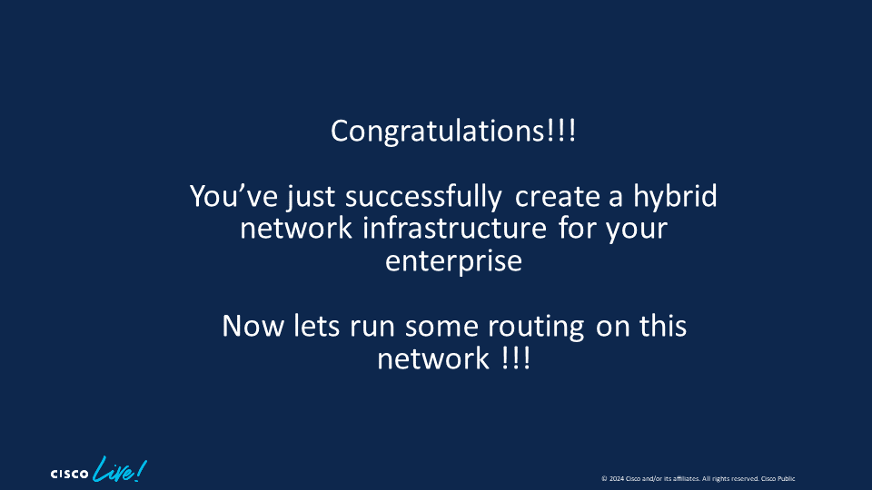

# Module 5 - Connecting Public and Private Infrastructre

|[Previous Module](https://github.com/git-shassan/LTRSP-2119/blob/main/Module%204%20-%20Creating%20Virtual%20Overlay%20on%20AWS/README.md)|[Main Menu](https://github.com/git-shassan/LTRSP-2119/blob/main/README.md)|
|----------------------------|----------------------------|


Now that the overlay infrastructure is created on AWS using XRd on both EKS and OpenShift; we will now conect On-Prem insfrastructure to the publich cloud overlay network. It will eventually allow us to configure VPN serices across this _Hybrid Network Infrastructe_


In this lab module, you will: 

1. Connect AWS based overlay network to on-prem network using GRE tunnel 
2. Run IGP across the hybrid network 
3. Enabled Segment Routing across the hybrid network 

Lets get working!!!

## 0. Ensure connectivity between public and private infra
In this exercise, you will configure static route on XRd1 and XRd2 as well as XRd5 to establish reachability between your On-Prem and public infra router

On **XRd1 & XRd2** copy paste the following configuration to create a default route:
```
 configure terminal
  router static
   address-family ipv4 unicast
    0.0.0.0/0 10.0.10.1
   !
  commit
end
```


## 1. Build an Overlay between your AWS and  On-Prem Network

In this module, you will establish GRE Tunnels between XRd1, XRD2, and XRd3 as shown below. 


In this set of exercise, you will establish GRE tunnels from XRd5 (OnPrem Containerized router) to XRd1 and XRd2 (your public cloud infrastructure) as shown in the figure above.

**Configure Tunnel Interface on XRd1**

Configure GRE Tunnel (interface tunnel-ip 15) on XRd1 using the configuration below to your on-prem (dcloud) router.


You can find your dcloud public IP in the session details tab on the dCloud webpage.


Copy paste the configuration below on XRd1 and **change the IP to your dCloud public IP**.
>[!NOTE]
>Make sure you use YOUR IP, not the one thats shown in the image above

```
configure terminal
interface tunnel-ip15
 mtu 1450
 ipv4 address 15.15.15.1 255.255.255.0
 tunnel source HundredGigE0/0/0/0
 tunnel destination [Your dCloud Public IP]
commit
```
**Configure Tunnel Interface on XRd1**

Verify the tunnel is up:
```
RP/0/RP0/CPU0:xrd1#sh ip inter brief tunnel-ip15
Interface                      IP-Address      Status                Protocol
tunnel-ip13                    15.15.15.1      Up                    Up      
```

**Configure Tunnel Interface on XRd2**

Configure a GRE Tunnel (interface tunnel-ip 25) on XRd2 using the configuration below.

Copy paste the configuration below on XRd1 and change the IP to your dCloud public IP that was gathered in Module 1. 
```
configure terminal
interface tunnel-ip25
 mtu 1450
 ipv4 address 25.25.25.2 255.255.255.0
 tunnel source HundredGigE0/0/0/0
 tunnel destination [your dcloud public IP]
commit
end

```


Verify the tunnel is up:
```
RP/0/RP0/CPU0:xrd2#
RP/0/RP0/CPU0:xrd2#sh ip  int br tunnel-ip 25
Interface                      IP-Address      Status                Protocol
tunnel-ip25                    25.25.25.2      Up                    Up      
```


**Configure Tunnel Interface on XRd5 (On Prem Router)**

To connect to the XRd5 (On Prem Router), first run this script to switch Kubecontexts back to the openshift Cluster

```
source ~/LTRSP-2119/scripts/ocp-onprem.sh
```

Then, to login to XRd5:

```
oc exec -it xrd-vrouter-0 -n xrd -- xr
```


Configure GRE Tunnels from XRd5 (the on-prem router running on Red Hat OpenShift) to XRd1 and XRd2 (routers running on public cloud). These are the tunnel interfaces that are configured on XRd5: 

* Tunnel Interface 15 - From XRd5 to XRd1
* Tunnel Interface 25 - From XRd5 to XRd2

If you copy/paste the config to routers, please make sure you use the appropriate IP addresses on the 'Tunnel Desitination'

> [!Tip]
> You can find the XRd1 and XRd2 public IPs in the [EC2 dashboard](https://us-east-1.console.aws.amazon.com/ec2/home?region=us-east-1#Instances:instanceState=running)
> 
> Go to Alpha > Networking > Network Interfaces for XRd1
> 
> Go to Beta > Networking > Network Interfaces for XRd1

```
configure terminal
interface tunnel-ip15
 mtu 1450
 ipv4 address 15.15.15.5 255.255.255.0
 tunnel source TenGigE0/0/0/0
 tunnel destination [Your Amazon Public IP for XRd1]
!
interface tunnel-ip25
 mtu 1450
 ipv4 address 25.25.25.5 255.255.255.0
 tunnel source TenGigE0/0/0/0
 tunnel destination [Your Amazon Public IP for XRd2]
!
commit
```

Verify the tunnels are up:
```
RP/0/RP0/CPU0:XRd5#show ip interface brief             
Interface                      IP-Address      Status          Protocol Vrf-Name
tunnel-ip15                    15.15.15.5      Up              Up       default 
tunnel-ip25                    25.25.25.5      Up              Up       default 
```


**Verify Tunnel Functionality**

Ping the tunnel interfaces of XRd1 and XRd2 from XRd5 as shown below. This will ensure your on-prem and ppublic cloud infra is now connected via an overlay network


```
RP/0/RP0/CPU0:XRd5#ping 15.15.15.1 source tunnel-ip15
Type escape sequence to abort.
Sending 5, 100-byte ICMP Echos to 15.15.15.1 timeout is 2 seconds:
!!!!!
Success rate is 100 percent (5/5), round-trip min/avg/max = 96/101/111 ms


RP/0/RP0/CPU0:XRd5#ping 25.25.25.2 source tunnel-ip25
Type escape sequence to abort.
Sending 5, 100-byte ICMP Echos to 25.25.25.2 timeout is 2 seconds:
!!!!!
Success rate is 100 percent (5/5), round-trip min/avg/max = 98/99/100 ms
RP/0/RP0/CPU0:XRd5#
```

---

If the ping is not successful, check with proctors for troubleshooting before proceeding. 

---





## 2. Establish IGP Routing Between Your On-Prem and Public Cloud Routers
In this exercise, you will establish a Routing and reacabliblity between your on-prem router (XRd5) and Cloud Infrastructure. The following figure shows

**Run ISIS On Your Cloud Network**

Put the created tunnels on XRd1 and XRd2 in the ISIS process created in the earlier module. Note that Lo100 has already been created and advertised via ISIS in the previous module. 


You can copy paste this configuration as is on **XRd1** to do this task. 
```
configure terminal
router isis 100
 interface tunnel-ip15
  point-to-point
  address-family ipv4 unicast
  commit
end

```

Next, copy & paste this configuration as is on **XRd2** to do this task. 
```
configure terminal
router isis 100
 interface tunnel-ip25
  point-to-point
  address-family ipv4 unicast
  commit
end

```
**Run ISIS On Your Cloud Network**

Now create a loopback 100 on XRd5, run ISIS on tunnel created in the previous step and advertise Lo1000 in the ISIS Process. 

You can copy & paste this configuration as is on **XRd5** to do this task. 

```
configure terminal
interface Loopback100
 ipv4 address 100.0.0.5 255.255.255.255

router isis 100
 is-type level-2-only
 net 49.0000.0000.0005.00
 address-family ipv4 unicast
  metric-style wide
  advertise link attributes
 !
 interface Loopback100
  address-family ipv4 unicast
  !
 !
 interface tunnel-ip15
  point-to-point
  hello-padding disable
  address-family ipv4 unicast
  !
 !
 interface tunnel-ip25
  point-to-point
  hello-padding disable
  address-family ipv4 unicast
commit
end

```


**Verify Routing and Reachability between OnPrem and Cloud Network**

On XRd5, check for neighbor relations, Loopback 100 routes in the routing table and ping between Loopback 100 IPs of XRd1, 2, and 3. 

```
RP/0/RP0/CPU0:XRd5#sh isis neigh
IS-IS 100 neighbors:
System Id      Interface        SNPA           State Holdtime Type IETF-NSF
xrd1           ti15             *PtoP*         Up    27       L2   Capable 
xrd2           ti25             *PtoP*         Up    24       L2   Capable 

Total neighbor count: 2
RP/0/RP0/CPU0:XRd5#sh ip route | inc 100.0.0
i L2 100.0.0.1/32 [115/20] via 15.15.15.1, 00:09:14, tunnel-ip15
i L2 100.0.0.2/32 [115/20] via 25.25.25.2, 00:09:14, tunnel-ip25
i L2 100.0.0.3/32 [115/30] via 15.15.15.1, 00:09:14, tunnel-ip15
L    100.0.0.5/32 is directly connected, 00:09:29, Loopback100


RP/0/RP0/CPU0:XRd5#ping 100.0.0.1 source loopback 100
Type escape sequence to abort.
Sending 5, 100-byte ICMP Echos to 100.0.0.1 timeout is 2 seconds:
!!!!!
Success rate is 100 percent (5/5), round-trip min/avg/max = 96/99/104 ms


RP/0/RP0/CPU0:XRd5#ping 100.0.0.2 source loopback 100
Fri Feb  2 00:01:57.110 UTC
Type escape sequence to abort.
Sending 5, 100-byte ICMP Echos to 100.0.0.2 timeout is 2 seconds:
!!!!!
Success rate is 100 percent (5/5), round-trip min/avg/max = 98/98/99 ms


RP/0/RP0/CPU0:XRd5#ping 100.0.0.3 source loopback 100
Fri Feb  2 00:02:03.627 UTC
Type escape sequence to abort.
Sending 5, 100-byte ICMP Echos to 100.0.0.3 timeout is 2 seconds:
!!!!!
Success rate is 100 percent (5/5), round-trip min/avg/max = 98/99/100 ms
RP/0/RP0/CPU0:XRd5#
```


Congratulations, you've established routing and reabability between your on-prem and public cloud infra. 

**Ensure you can ping between the nodes before proceeding to the next section. Check with the proctors if pings are not successful.**


## 3. Enable Segment Routing (SR-MPLS) across the hybrid network Insfrastructure

In this exercise, you will enable segment routing throughout the hybrid cloud infrastructure. Please note that only basic SR-MPLS functionality is used here, as this is not an indepth SR-MPLS Lab. 

The fowllowing topology is implemeted in this exercise: 


Lets get working!!! 

**Enable Segment Routing on XRd1**

You can copy paste the following configuration on XRd1 to enable segment routing: 

```
configure terminal
router isis 100
 address-family ipv4 unicast
  segment-routing mpls sr-prefer
 !
 interface Loopback100
  address-family ipv4 unicast
   prefix-sid index 1
  !
 !
!
mpls oam
!
segment-routing
 global-block 16000 17000
commit
end

```

**Enable Segment Routing on XRd2**

You can copy paste the following configuration on XRd2 to enable segment routing: 

```
configure terminal
router isis 100
 address-family ipv4 unicast
  segment-routing mpls sr-prefer
 !
 interface Loopback100
  address-family ipv4 unicast
   prefix-sid index 2
  !
 !
!
mpls oam
!
segment-routing
 global-block 16000 17000
commit
end

```


**Enable Segment Routing on XRd3**

You can copy paste the following configuration on XRd3 to enable segment routing: 

```
configure terminal
router isis 100
 address-family ipv4 unicast
  segment-routing mpls sr-prefer
 !
 interface Loopback100
  address-family ipv4 unicast
   prefix-sid index 3
  !
 !
!
mpls oam
!
segment-routing
 global-block 16000 17000
commit
end

```


**Enable Segment Routing on XRd5**

You can copy paste the following configuration on XRd5 to enable segment routing: 

```
configure terminal
router isis 100
 address-family ipv4 unicast
  segment-routing mpls sr-prefer
 !
 interface Loopback100
  address-family ipv4 unicast
   prefix-sid index 5
  !
 !
!
mpls oam
!
segment-routing
 global-block 16000 17000
commit
end

```


**Verify Segment Routing Functionality**

You can verify the Segment Routing Functionaltity by looking at the MPLS forwarding table and doing an MPLS ping between routers. In this case we will ping between XRd5 and routers on the public cloud (XRd1, 2, and 3) 

```
RP/0/RP0/CPU0:XRd5#sh mpls forwarding 
Fri Feb  2 03:51:06.726 UTC
Local  Outgoing    Prefix             Outgoing     Next Hop        Bytes       
Label  Label       or ID              Interface                    Switched    
------ ----------- ------------------ ------------ --------------- ------------
16001  Pop         SR Pfx (idx 1)     ti15         15.15.15.1      0           
16002  Pop         SR Pfx (idx 2)     ti25         25.25.25.2      0           
16003  16003       SR Pfx (idx 3)     ti15         15.15.15.1      0           
       16003       SR Pfx (idx 3)     ti25         25.25.25.2      0           
16005  Aggregate   SR Pfx (idx 5)     default                      0           
24000  Pop         SR Adj (idx 1)     ti15         15.15.15.1      0           
24001  Pop         SR Adj (idx 3)     ti15         15.15.15.1      0           
24002  Pop         SR Adj (idx 1)     ti25         25.25.25.2      0           
24003  Pop         SR Adj (idx 3)     ti25         25.25.25.2      0           


RP/0/RP0/CPU0:XRd5#ping sr-mpls 100.0.0.3 255.255.255.255
Type escape sequence to abort.
!!!!!
Success rate is 100 percent (5/5), round-trip min/avg/max = 99/100/102 ms

```

If time permits, you can perform the same checks on XRd 1, 2, 3 for completeness. 

Lets move to the final module to configure VPN Services across hybrid network infrastructure.


|[Previous Module](https://github.com/git-shassan/LTRSP-2119/blob/main/Module%204%20-%20Creating%20Virtual%20Overlay%20on%20AWS/README.md)|[Main Menu](https://github.com/git-shassan/LTRSP-2119/blob/main/README.md)|
|----------------------------|----------------------------|
