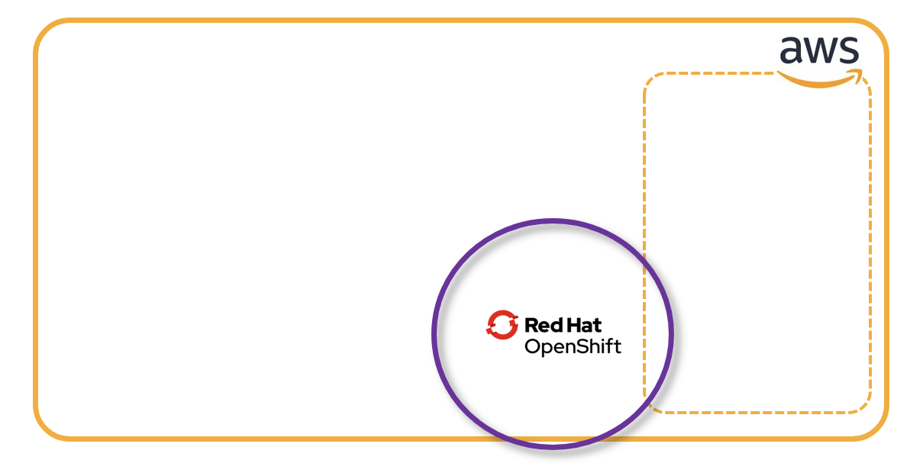
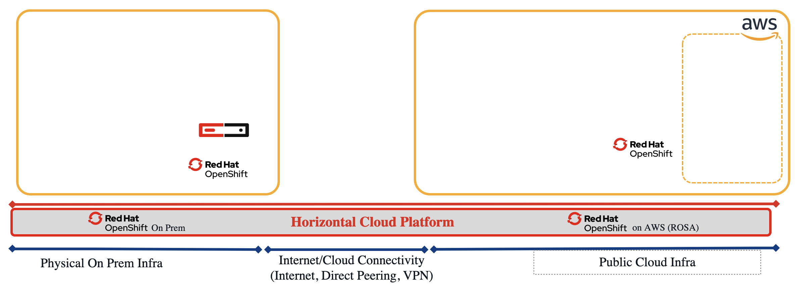

# Module 1 - OpenShift Install on Public Cloud 
|[Previous Module](https://github.com/git-shassan/LTRSP-2119/blob/main/Module%200%20-%20Setup%20Environment/README.md)|[Main Menu](https://github.com/git-shassan/LTRSP-2119/blob/main/README.md)|[Next Module](https://github.com/git-shassan/LTRSP-2119/blob/main/Module%202%20-%20XRd%20on%20OpenShift%20onprem/README.md)|
|----------------------------|----------------------------|----------------------------|

---
## Please treat this module as a bonus and attempt this module after Module 5
---


In this module, you will install OpenShift Single Node Cluster on a public cloud environment. Since the private cloud OpenShift is pre-provisioned in the lab environment, after completing this module you would have a unified Cloud Platform across hybrid cloud


### Install and Configure the AWS CLI with the demo account
    curl "https://awscli.amazonaws.com/awscli-exe-linux-x86_64.zip" -o "awscliv2.zip"
    unzip awscliv2.zip
    sudo ./aws/install

#### Access your AWS account
You should have received your AWS credentials from the lab proctors.

Let's configure our AWS CLI to have access to our demo account

    aws configure


And fill in the the Access Key ID and Secret access key parameters using the values we just downloaded. We will us eu-west-1 as our default region.

    AWS Access Key ID [None]: ****************NX6K
    AWS Secret Access Key [None]: ****************yUF4
    Default region name [None]: eu-west-1
    Default output format [None]: 

#### Verify AWS account setup: 
The following command can be used to verify if the AWS account credentials are valid and properly configured: 
```
aws sts get-caller-identity
```
The output will look similiar to this: 
```
{
    "UserId": "AIDA47CRU2Z6CONHUF2XA",
    "Account": "891376948860",
    "Arn": "arn:aws:iam::891376948860:user/ocp"
}
```

### OpenShift Install Client: 

#### Download the installer: 
Download openshift-install client:
```
 wget https://mirror.openshift.com/pub/openshift-v4/x86_64/clients/ocp/4.14.7/openshift-install-linux.tar.gz 
```
It will result in the following output: 
```
openshift-install-linux.tar.gz             100%[======================================================================================>] 411.41M  28.4MB/s    in 15s     

2024-01-27 22:23:53 (26.8 MB/s) - ‘openshift-install-linux.tar.gz’ saved [431390009/431390009]
```
Now untar the file using the following command: 
```
 tar -xvf openshift-install-linux.tar.gz 
```
This will extract the "openshift-install" binary file 

#### Set up the Installer: 
Lets do the following extra steps so that the installation tools's autocomplete is enabled and the binary is moved to a location in the seasrch path:
```
./openshift-install completion bash > install.bash
source ./install.bash 
mv ./install.bash /etc/bash_completion.d/
mv openshift-install /usr/bin/
```
#### Installing OpenShift: 
Typically, the installation tool will be used to first generate an installation configuration file (called "install-config.yaml") using interactive questions. This step has already been completed in your lab. The file can be copied from its current location and can be directly used to start the installation process. 

Copy the prebuilt install-config.yaml file into a new directory using the folliwng command: 

> [!IMPORTANT]  
> replace the HHHH in the following command with the pod number that you are using. For example, if you are assinged lab pod number "12", then use the command 
cp LTRSP-2119/manifests/ocp_aws/install-config.yaml_12 ocpaws/install-config.yaml

```
cd ~
mkdir ocpaws
cp LTRSP-2119/manifests/ocp_aws/install-config.yaml_HHHH ocpaws/install-config.yaml
```

Your environment is now ready to proceed with the installation using a single command, that is shown here: 
```
openshift-install create cluster --dir=./ocpaws
```

This process will take about 30 minutes. So you can leave this Terminal window running in the background and proceed with the rest of the tasks.  Towards the end of the lab, you will be asked to come back to this window and verify the state of the installation.  At that point, as a bonus exercise, you will also be provided steps to run XRd on this OpenShift environment and connect it to the other parts of the virualized transport network. 

Once this installation is complete, you would have the following state your lab: 


> [!NOTE]
> Please proceed to the next lab module

At that point, if the process has successfully completed, you will see an output similiar o the following to indicate installation completion:
```
<snip>                 
INFO Checking to see if there is a route at openshift-console/console...       
INFO Install complete!                            
INFO To access the cluster as the system:admin user when using 'oc', run 'export KUBECONFIG=/root/auth/kubeconfig' 
INFO Access the OpenShift web-console here: https://console-openshift-console.apps.awsocp.emea1.cloudify.network 
INFO Login to the console with user: "kubeadmin", and password: "FaTXV-6ep3F-U5sUi-UU3TS"                   
INFO Time elapsed: 30m11s                         
[root@rocky ~]# 
```

<!-- 
After the cluster is installed, check its state using basic verification command:
```
oc get nodes
```
The output would look like the following - notice the "Ready" in the STATUS column:
```
NAME                                        STATUS   ROLES                         AGE     VERSION
ip-10-0-25-230.eu-west-1.compute.internal   Ready    control-plane,master,worker   3h32m   v1.27.8+4fab27b
```
Another one to check will be: 
```
oc get clusterversion
```
This output should show like the following: 
```
NAME      VERSION   AVAILABLE   PROGRESSING   SINCE   STATUS
version   4.14.7    True        False         3h9m    Cluster version is 4.14.7
```
Finally check the status of cluster level operators: 
```
oc get co
```
The output should show that all of the operators are healthy (DEGRAGED=False, AVAILABLE=True)
```
NAME                                       VERSION   AVAILABLE   PROGRESSING   DEGRADED   SINCE   MESSAGE
authentication                             4.14.7    True        False         False      3h9m    
baremetal                                  4.14.7    True        False         False      3h28m   
cloud-controller-manager                   4.14.7    True        False         False      3h32m   
cloud-credential                           4.14.7    True        False         False      3h33m   
cluster-autoscaler                         4.14.7    True        False         False      3h28m   
config-operator                            4.14.7    True        False         False      3h29m   
console                                    4.14.7    True        False         False      3h10m   
control-plane-machine-set                  4.14.7    True        False         False      3h28m   
csi-snapshot-controller                    4.14.7    True        False         False      3h29m   
dns                                        4.14.7    True        False         False      3h26m   
etcd                                       4.14.7    True        False         False      3h26m   
image-registry                             4.14.7    True        False         False      3h15m   
ingress                                    4.14.7    True        False         False      3h15m   
insights                                   4.14.7    True        False         False      3h16m   
kube-apiserver                             4.14.7    True        False         False      3h16m   
kube-controller-manager                    4.14.7    True        False         False      3h25m   
kube-scheduler                             4.14.7    True        False         False      3h21m   
kube-storage-version-migrator              4.14.7    True        False         False      3h29m   
machine-api                                4.14.7    True        False         False      3h21m   
machine-approver                           4.14.7    True        False         False      3h28m   
machine-config                             4.14.7    True        False         False      3h27m   
marketplace                                4.14.7    True        False         False      3h28m   
monitoring                                 4.14.7    True        False         False      3h9m    
network                                    4.14.7    True        False         False      3h31m   
node-tuning                                4.14.7    True        False         False      3h28m   
openshift-apiserver                        4.14.7    True        False         False      3h14m   
openshift-controller-manager               4.14.7    True        False         False      3h15m   
openshift-samples                          4.14.7    True        False         False      3h13m   
operator-lifecycle-manager                 4.14.7    True        False         False      3h29m   
operator-lifecycle-manager-catalog         4.14.7    True        False         False      3h29m   
operator-lifecycle-manager-packageserver   4.14.7    True        False         False      3h20m   
service-ca                                 4.14.7    True        False         False      3h29m   
storage                                    4.14.7    True        False         False      3h21m
```

7. set the kubeconfig file
8. Run the following command to check the state of interfaces on the node:
```
 oc debug node/$(oc get nodes -ojsonpath='{.items[].metadata.name}') -- chroot /host /bin/bash -c 'ech
o ============; ip -br a | grep ens; echo ============'
```
The output would look something like: 
```
Starting pod/ip-10-0-25-230eu-west-1computeinternal-debug-xzb2s ...
To use host binaries, run `chroot /host`
============
ens3             UP             
============

Removing debug pod ..
```
This shows that there is one interface currently available. 

8. Add another interface to the node, using the following script:
   
--> 


|[Previous Module](https://github.com/git-shassan/LTRSP-2119/blob/main/Module%200%20-%20Setup%20Environment/README.md)|[Main Menu](https://github.com/git-shassan/LTRSP-2119/blob/main/README.md)|[Next Module](https://github.com/git-shassan/LTRSP-2119/blob/main/Module%202%20-%20XRd%20on%20OpenShift%20onprem/README.md)|
|----------------------------|----------------------------|----------------------------|


# Module 6 - Install and Configure XRd on OpenShift in Public Cloud: 

|[Previous Module](https://github.com/git-shassan/LTRSP-2119/blob/main/Module%205%20-%20Connecting%20Physical%20and%20Cloud%20Infrastructure/README.md)|[Main Menu](https://github.com/git-shassan/LTRSP-2119/blob/main/README.md)||
|----------------------------|----------------------------|----------------------------|

In Module #1, you had started the installation of an OpenShift cluster on AWS. This cluster would have completed its installation 
by now (normally takes around 30 mins since the time you started the installation). You can revisit the termminal window where the 
installation was run to verify the installation is completed. 

#### Switching context to OpenShift Cluster on AWS: 
Towards the end of the installation, the tool prints the location of kubeconfig file as well as kubeadmin credentials. You can always retrive that information later as well. However, for the purpose of the lab, you dont need to manually retrieve that and you can  start accessing the OpenShift cluster on AWS by altering the shell environmnet for "openshift client" 
to use this kubeconfig for subsequent commands: 
```
source ~/LTRSP-2119/scripts/ocp-aws.sh

```
> [!TIP]
> You can always switch back to the OpenShift cluster on-prem by using "source ~/LTRSP-2119/scripts/ocp-onprem.sh". 
> Similarly, to switch the context of openshift client to EKS cluster, use "source ~/LTRSP-2119/scripts/eks.sh"

#### Verifying the basic health of the cluster: 
You can run the following basic commands to verify that the cluster is in good health: 
```
oc get co

```
This command shows the state of all of the default installed clsuter operators. All the operators should be showing up as AVAIALABLE (True), and not DEGRADED (False) 
```
oc get co
NAME                                       VERSION   AVAILABLE   PROGRESSING   DEGRADED   SINCE   MESSAGE
authentication                             4.14.7    True        False         False      3h7m    
baremetal                                  4.14.7    True        False         False      3h22m   
cloud-controller-manager                   4.14.7    True        False         False      3h25m
<snip>
```
Another command to check will be: 
```
oc get clusterversion

```
The output wil show the cluter's version and its availability: 
```
NAME      VERSION   AVAILABLE   PROGRESSING   SINCE   STATUS
version   4.14.7    True        False         3h10m   Cluster version is 4.14.7

```

> [!TIP]
> If you don't see the desired output, you can check if the installation was successfully run by pasting the folloiwng commands:
> ```
> cd ~/ocpaws/
> openshift-install wait-for install-complete --dir=./ 
> ```

#### Add extra interface to the cluster node: 
By default, the installer provisioned OpenShift cluster has one interface assigned to in the public cloud environment. This is sufficent for most use cases and applications, and the traffic coming in through the interface can use kubernetes services, ingress and/or routes to be directed to the appropriate application. 

However, some applications require one or more dedicated interfaces for their use. XRd is one such application, where its data interfaces do not use the primary kubernetes interface (often referred to as "primary CNI interface"). 

To add a second interface to the openshift cluster that we have deployed in the lab, the following simple script can be run: 
```
python ~/LTRSP-2119/scripts/interface_add.py

```

You can verify that this interface was added and allocated an IP address using the following command: 
```
oc describe nodes | grep -A2 Addresses:

```
The output will look similiar to : 
```
oc describe nodes | grep -A2 Addresses:
Addresses:
  InternalIP:   10.0.16.116
  InternalIP:   10.0.11.151
```

Make a note of this new IP address in the 10.0.11.0/24 subnet. 

### Installing XRd: 
To install XRd on this OpenShift cluster, we don't need to apply the manifests one by one. Now that you are well aware of the purpose of the manifests, you can apply them in a batch using a method call "Kustomize". The following command will do that for you: 
```
cd ~
source LTRSP-2119/scripts/ocp-aws.sh
oc apply -k LTRSP-2119/manifests/xrd_ocp_onprem/
```

### Connect to the XRd router running on OpenShift in AWS: 
To connect to the router, you can now run: 
```
oc exec -it -n xrd xrd-control-plane-0 -- xr

```


|[Previous Module](https://github.com/git-shassan/LTRSP-2119/blob/main/Module%205%20-%20Connecting%20Physical%20and%20Cloud%20Infrastructure/README.md)|[Main Menu](https://github.com/git-shassan/LTRSP-2119/blob/main/README.md)||
|----------------------------|----------------------------|----------------------------|


